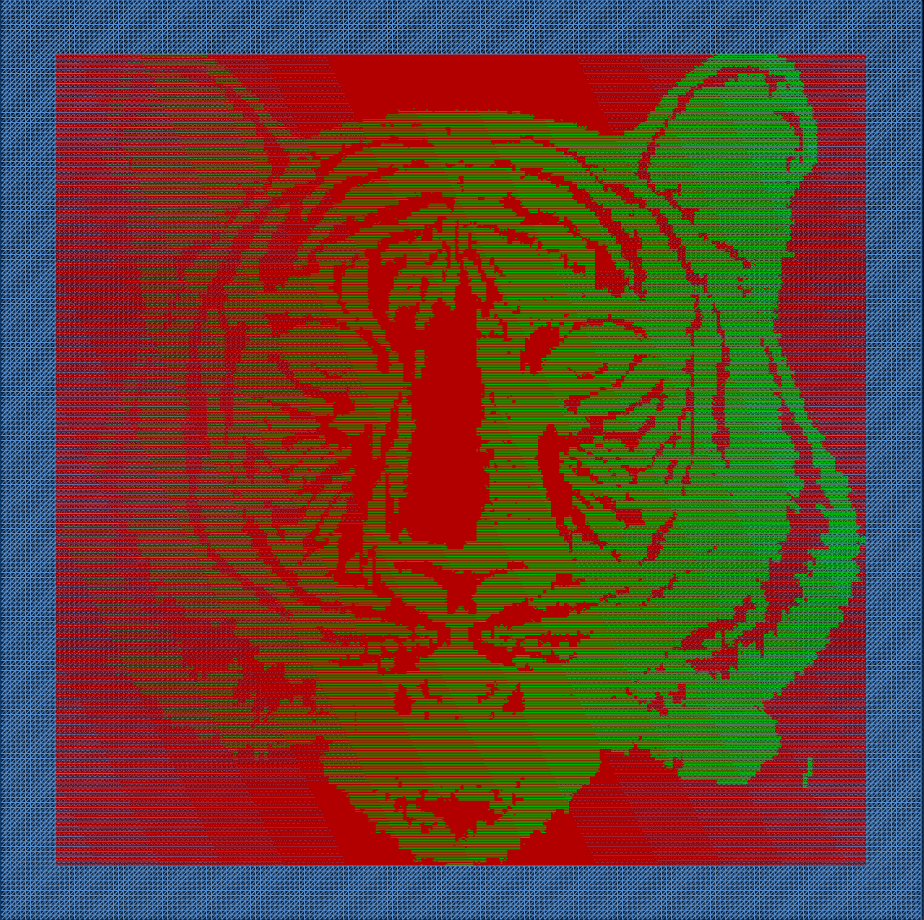
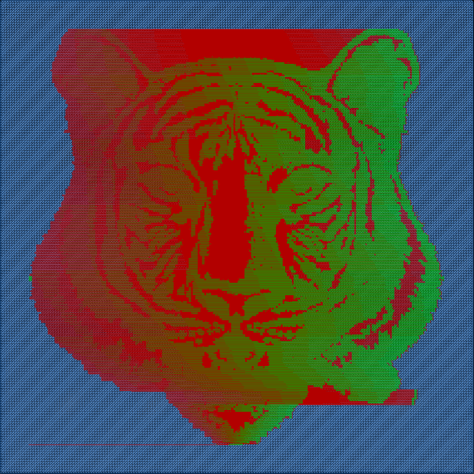

摘要：本文详细介绍了如何利用OpenCV库将灰度图转换为GCode，并通过单向扫描实现激光雕刻。GCode作为控制数控机床和3D打印机的关键语言，在数字制造中具有重要地位。通过结合OpenCV的计算机视觉能力，我们能够高效地将图像转化为机器可执行的指令，实现对图像的精准物理输出。文章提供了代码示例和详细步骤，助力读者掌握灰度图像到GCode的单向扫描转换过程。这一技术将为数字制造领域带来更灵活、高效的图像加工方案。

- [基于OpenCV灰度图像转GCode的单向扫描实现](#基于opencv灰度图像转gcode的单向扫描实现)
  - [引言](#引言)
  - [单向扫描存在的问题](#单向扫描存在的问题)
  - [灰度图像单向扫描代码示例](#灰度图像单向扫描代码示例)
  - [结论](#结论)

# 基于OpenCV灰度图像转GCode的单向扫描实现
本文将介绍如何使用OpenCV库将灰度图转换为GCode，并通过单向扫描实现对图像的激光雕刻。GCode是一种用于控制数控机床和3D打印机的指令语言，而OpenCV是一种开源计算机视觉库。通过结合这两者，我们可以实现从图像到GCode的转换，进而在机器上实现图像的物理输出。

## 引言
在数字制造时代，将图像转换为GCode是实现自动化加工和打印的关键步骤。本文将探讨如何利用OpenCV库将灰度图转换为GCode，并通过单向扫描的方式实现对图像的激光雕刻。

原始图像：


单向扫描转换结果：



单向扫描优化版转换结果：



## 单向扫描存在的问题
单向操作存在来回折返空行程问题，导致加工时间变长。
本文主要通过使用以下形式的代码，删除了多余的行程（空跑没任何意义的G0）。
```c++
while(++x < image.cols && image.at<std::uint8_t>(y, x) == 255) {
    length++;
}
--x;
```
实现了未优化版本和优化版本的单向扫描，两者加工时间从生成的GCode代码上，可以看出有了很大差异。

红色是 G0，绿色是加工部分 G1。

当然如果使用双向扫描方向，加工时间差异会更大。

## 灰度图像单向扫描代码示例
```c++
#pragma once
#include <opencv2/opencv.hpp>
#include <fstream>
#include <print>
#include <vector>
#include <optional>
#include <ranges>

struct G0 {
    std::optional<float> x, y;
    std::optional<int> s;

    std::string toString() {
        std::string command = "G0";
        if(x.has_value()) {
            command += std::format(" X{:.3f}", x.value());
        }
        if(y.has_value()) {
            command += std::format(" Y{:.3f}", y.value());
        }
        if(s.has_value()) {
            command += std::format(" S{:d}", s.value());
        }
        return command;
    }

    explicit  operator std::string() const {
        std::string command = "G0";
        if(x.has_value()) {
            command += std::format(" X{:.3f}", x.value());
        }
        if(y.has_value()) {
            command += std::format(" Y{:.3f}", y.value());
        }
        if(s.has_value()) {
            command += std::format(" S{:d}", s.value());
        }
        return command;
    }
};

struct G1 {
    std::optional<float> x, y;
    std::optional<int> s;

    std::string toString() {
        std::string command = "G1";
        if(x.has_value()) {
            command += std::format(" X{:.3f}", x.value());
        }
        if(y.has_value()) {
            command += std::format(" Y{:.3f}", y.value());
        }
        if(s.has_value()) {
            command += std::format(" S{:d}", s.value());
        }
        return command;
    }

    explicit operator std::string() const {
        std::string command = "G1";
        if(x.has_value()) {
            command += std::format(" X{:.3f}", x.value());
        }
        if(y.has_value()) {
            command += std::format(" Y{:.3f}", y.value());
        }
        if(s.has_value()) {
            command += std::format(" S{:d}", s.value());
        }
        return command;
    }
};

class ImageToGCode
{
public:
    // 激光模式
    enum class LaserMode {
        Cutting,    // 切割 M3 Constant Power
        Engraving,  // 雕刻 M4 Dynamic Power
    };

    // 扫描方式
    enum class ScanMode {
        Unidirection,  // 单向
        Bidirection,   // 双向
    };

    struct kEnumToStringLaserMode {
        constexpr std::string_view operator[](const LaserMode mode) const noexcept {
            switch(mode) {
                case LaserMode::Cutting: return "M3";
                case LaserMode::Engraving: return "M4";
            }
            return {};
        }

        constexpr LaserMode operator[](const std::string_view mode) const noexcept {
            if(mode.compare("M3")) {
                return LaserMode::Cutting;
            }
            if(mode.compare("M4")) {
                return LaserMode::Engraving;
            }
            return {};
        }
    };

    ImageToGCode() = default;

    ~ImageToGCode() = default;

    auto &setInputImage(const cv::Mat &mat) {
        this->mat = mat;
        return *this;
    }

    auto &setOutputTragetSize(double width, double height, double resolution = 10.0 /* lin/mm */) {
        this->width      = width;
        this->height     = height;
        this->resolution = resolution;
        return *this;
    }

    auto &builder() {
        command.clear();
        try {
            matToGCode();
        } catch(cv::Exception &e) {
            std::println("cv Exception {}", e.what());
        }

        std::vector<std::string> header;
        header.emplace_back("G17G21G90G54");                                             // XY平面;单位毫米;绝对坐标模式;选择G54坐标系
        header.emplace_back(std::format("F{:d}", 30000));                                // 移动速度 毫米/每分钟
        header.emplace_back(std::format("G0 X{:.3f} Y{:.3f}", 0.f, 0.f));                // 设置工作起点及偏移
        header.emplace_back(std::format("{} S0", kEnumToStringLaserMode()[laserMode]));  // 激光模式
        if(airPump.has_value()) {
            header.emplace_back(std::format("M16 S{:d}", 300));  // 打开气泵
        }

        std::vector<std::string> footer;
        footer.emplace_back("M5");
        if(airPump.has_value()) {
            footer.emplace_back("M9");  // 关闭气泵，保持 S300 功率
        }

        command.insert_range(command.begin(), header);
        command.append_range(footer);

        return *this;
    }

    bool exportGCode(const std::string &fileName) {
        std::fstream file;
        file.open(fileName, std::ios_base::out | std::ios_base::trunc);
        if(!file.is_open()) {
            return false;
        }

        for(auto &&v: command | std::views::transform([](auto item) { return item += "\n"; })) {
            file.write(v.c_str(), v.length());
        }

        return true;
    }

    auto setLaserMode(LaserMode mode) {
        laserMode = mode;
        return *this;
    }

    auto setScanMode(ScanMode mode) {
        scanMode = mode;
        return *this;
    }

private:
    void matToGCode() {
        assert(mat.channels() == 1);
        assert(std::isgreaterequal(resolution, 1e-5f));
        assert(!((width * resolution < 1.0) || (height * resolution < 1.0)));

        unidirectionStrategy();
    }

    void internal(cv::Mat &image, auto x /*width*/, auto y /*height*/) {
        auto pixel = image.at<cv::uint8_t>(y, x);
        if(pixel == 255) {
            command.emplace_back(G0(x / resolution, y / resolution, std::nullopt));
        } else {
            auto power = static_cast<int>((1.0 - static_cast<double>(pixel) / 255.0) * 1000.0);
            command.emplace_back(G1(x / resolution, y / resolution, power));
        }
    }

    // 单向扫描
    // 未做任何优化处理，像素和G0、G1一一映射对应。
    void unidirectionStrategy() {
        cv::Mat image;
        cv::resize(mat, image, cv::Size(static_cast<int>(width * resolution), static_cast<int>(height * resolution)));
        cv::imshow("mat",image);
        cv::waitKey(0);
        for(int y = 0; y < image.rows; ++y) {
            command.emplace_back(G0(0, y / resolution, std::nullopt).toString());
            for(int x = 0; x < image.cols; ++x) {
                auto pixel = image.at<uchar>(y, x);
                if(pixel == 255) {
                    command.emplace_back(G0(x / resolution, std::nullopt, std::nullopt));
                } else {
                    auto power = static_cast<int>((1.0 - static_cast<double>(pixel) / 255.0) * 1000.0);
                    command.emplace_back(G1(x / resolution, std::nullopt, power));
                }
            }
        }
    }

    // 单向扫描优化版本V1
    // 删除多余空行程，这里空行程指连续的无用的G0。
    void unidirectionOptStrategy() {
        cv::Mat image;
        cv::resize(mat, image, cv::Size(static_cast<int>(width * resolution), static_cast<int>(height * resolution)));
        int offset = 0;  // The frist consecutive G0
        int length = 0;
        for(int y = 0; y < image.rows; ++y) {
            command.emplace_back(G0(offset / resolution, y / resolution, std::nullopt).toString());
            for(int x = 0; x < image.cols; ++x) {
                auto pixel = image.at<uchar>(y, x);
                length     = 0;
                if(pixel == 255) {
                    while(++x < image.cols && image.at<std::uint8_t>(y, x) == 255) {
                        length++;
                    }
                    --x;

                    // Whether continuous GO exists
                    if(length) {
                        if(x - length == 0) {  // skip The frist consecutive G0
                            offset = length;
                            command.emplace_back(G0((x) / resolution, std::nullopt, std::nullopt));
                            continue;
                        }

                        if(x == image.cols - 1) {  // skip The last consecutive G0
                            command.emplace_back(G0((x - length) / resolution, std::nullopt, std::nullopt));
                            continue;
                        }
                        // Continuous GO
                        command.emplace_back(G0(x / resolution, std::nullopt, std::nullopt));
                    } else {
                        // Independent GO
                        command.emplace_back(G0(x / resolution, std::nullopt, std::nullopt));
                    }
                } else {
                    auto power = static_cast<int>((1.0 - static_cast<double>(pixel) / 255.0) * 1000.0);
                    command.emplace_back(G1(x / resolution, std::nullopt, power));
                }
            }
        }
    }

    // Define additional strategy functions here
private:
    cv::Mat mat;                                 // 灰度图像
    double width {0};                            // 工作范围 x 轴
    double height {0};                           // 工作范围 y 轴
    double resolution {0};                       // 精度 lin/mm
    ScanMode scanMode {ScanMode::Bidirection};   // 默认双向
    LaserMode laserMode {LaserMode::Engraving};  // 默认雕刻模式
    std::optional<int> airPump;                  // 自定义指令 气泵 用于吹走加工产生的灰尘 范围 [0,1000]
    // add more custom cmd
    std::vector<std::string> command;            // G 代码
};

int main() {
    // 读取以灰度的形式读取一个图像
    cv::Mat mat = cv::imread(R"(ImageToGCode\image\tigger.jpg)", cv::IMREAD_GRAYSCALE);
    cv::flip(mat, mat, 0);

    // 实例化一个对象
    ImageToGCode handle;
    // 设置相关参数
    // setInputImage 输入图像
    // setOutputTragetSize 输出物理尺寸大小 以 mm 为单位，这里输出 50x50 mm 大小
    // builder 开始执行图像转GCode操作
    // exportGCode 导出 gcode 文件
    handle.setInputImage(mat).setOutputTragetSize(50,50).builder().exportGCode(R"(ImageToGCode\output\001.nc)");
}
```

## 结论
通过结合OpenCV和GCode，我们成功地将灰度图转换为机器可执行的指令，实现了对图像的单向扫描激光雕刻。这种方法可应用于数控机床和3D打印机等领域，为数字制造提供了更灵活的图像处理和加工方式。