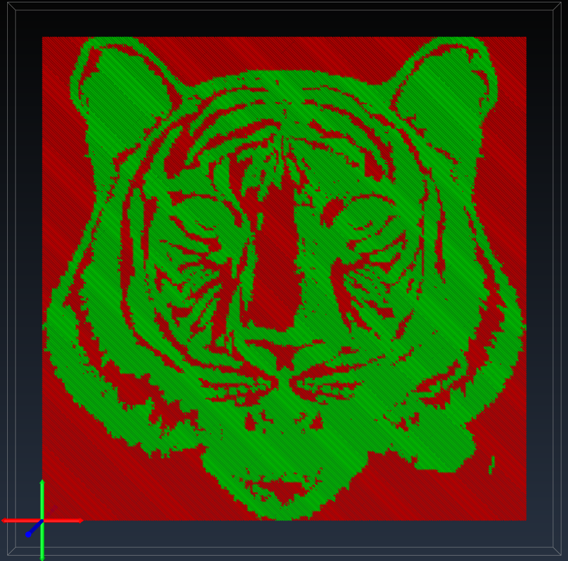
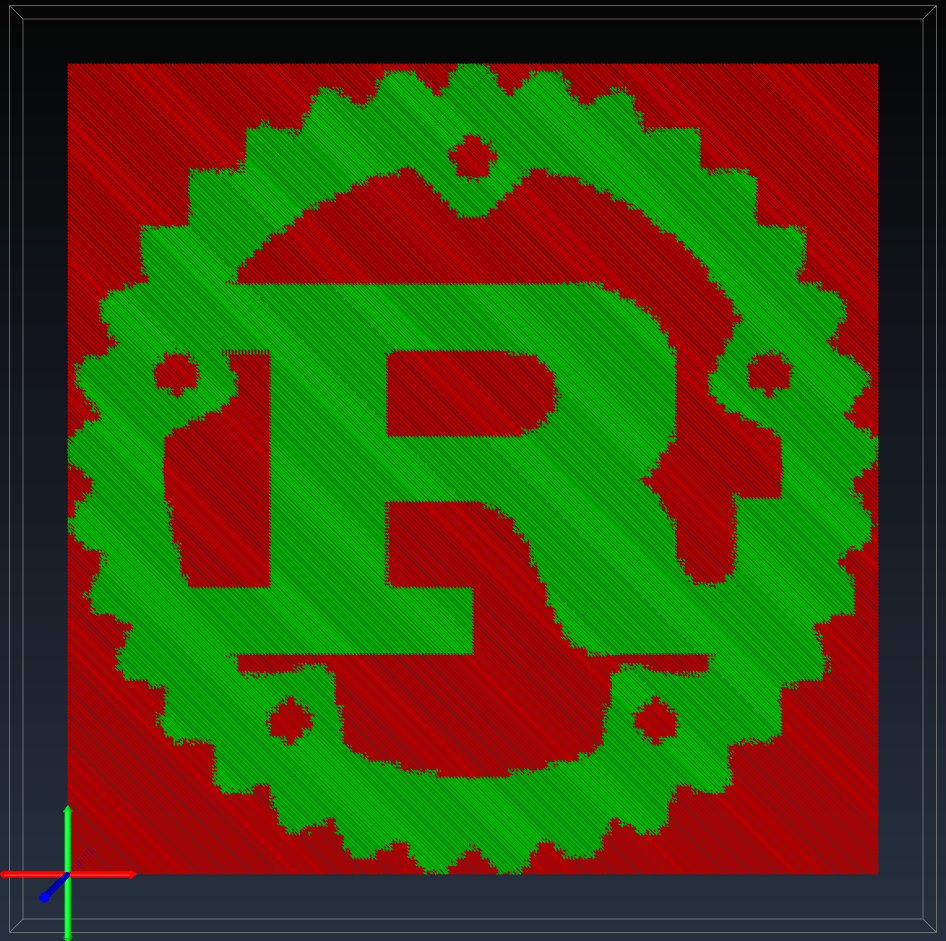

# 基于OpenCV灰度图像转GCode的斜向扫描实现
- [基于OpenCV灰度图像转GCode的斜向扫描实现](#基于opencv灰度图像转gcode的斜向扫描实现)
- [基于OpenCV灰度图像转GCode的斜向扫描实现](#基于opencv灰度图像转gcode的斜向扫描实现-1)
  - [引言](#引言)
  - [激光雕刻简介](#激光雕刻简介)
  - [OpenCV简介](#opencv简介)
  - [实现步骤](#实现步骤)
    - [1.导入必要的库](#1导入必要的库)
    - [2. 读取灰度图像](#2-读取灰度图像)
    - [3. 图像预处理](#3-图像预处理)
    - [4. 生成GCode](#4-生成gcode)
    - [5. 保存生成的GCode](#5-保存生成的gcode)
    - [6. 灰度图像斜向扫描代码示例](#6-灰度图像斜向扫描代码示例)
  - [总结](#总结)

# 基于OpenCV灰度图像转GCode的斜向扫描实现



 


## 引言
激光雕刻技术作为一种创新的制造方法，近年来在艺术、制作和教育领域崭露头角。本文将介绍如何使用OpenCV库实现灰度图像到GCode的斜向扫描，为激光雕刻提供更灵活、更精细的图案生成方法。同时，我们将分享关键的代码片段，帮助读者理解并应用这一技术。

## 激光雕刻简介
激光雕刻是一种通过激光束切割或去除材料表面的工艺，通常用于制作艺术品、装饰品和原型。通过控制激光束的运动路径，可以在各种材料上创造出精细而复杂的图案。在这篇博客中，我们将使用OpenCV实现一种激光雕刻的图案生成方法，具体来说是灰度图像到GCode的斜向扫描。

## OpenCV简介
OpenCV是一个开源的计算机视觉库，广泛应用于图像处理、机器学习和计算机视觉领域。其强大的功能和易用性使得它成为实现图像处理任务的理想选择。在本文中，我们将使用OpenCV来处理灰度图像，并将其转换为GCode。

## 实现步骤

### 1.导入必要的库
首先，我们需要导入必要的库，包括OpenCV和一些用于图像处理的辅助库。以下是关键的CMake代码片段：
```cmake
# 指向 OpenCV cmake 目录
list(APPEND CMAKE_PREFIX_PATH "~/opencv/build/x64/vc16/lib")

find_package(OpenCV REQUIRED)
include_directories(${OpenCV_INCLUDE_DIRS})
link_libraries(${OpenCV_LIBS})
```
把上述内容添加到 cmake 中，此时我们已经可以在 C++ 中使用 OpenCV 库

### 2. 读取灰度图像
使用OpenCV读取一张灰度图像，我们将其用于后续的处理。以下是代码片段：
```cpp
cv::Mat mat = cv::imread(R"(~/ImageToGCode/image/tigger.jpg)", cv::IMREAD_GRAYSCALE);
```
确保替换 `~/ImageToGCode/image/tigger.jpg` 为你自己的图像文件路径。

### 3. 图像预处理
在进行激光雕刻之前，我们需要对图像进行一些预处理，以确保得到清晰而准确的结果。这可能包括图像平滑、二值化、边缘检测等步骤，具体取决于你的图像和需求。以下是一个简单的翻转和二值化处理的代码片段：
```cpp
cv::flip(mat, mat, 0);
cv::threshold(mat,mat,128,255,cv::ThresholdTypes::THRESH_BINARY);
```

### 4. 生成GCode
有了预处理后的图像，我们可以开始生成GCode了。GCode是一种机器语言，用于控制激光雕刻、数控机床和3D打印机等设备。以下是斜向扫描生成GCode的代码片段：

```cpp
cv::Mat image;
cv::resize(mat, image, cv::Size(static_cast<int>(width * resolution), static_cast<int>(height * resolution)));
for(int k /*diagonal*/ = 0; k < image.rows + image.cols - 1 /*cond = height + width - 1*/; ++k) {
    if((k & 1) == 0) {
        // even
        for(int i = std::min(k, image.rows - 1); i >= 0; --i) {
            int j = k - i;
            if(i < image.rows && j < image.cols) {
                internal(image, j, i);
            }
        }
    } else {
        // odd
        for(int j = std::min(k, image.cols - 1); j >= 0; --j) {
            int i = k - j;
            if(i < image.rows && j < image.cols) {
                internal(image, j, i);
            }
        }
    }
}
```
这个函数将生成一个包含GCode指令的列表，你可以将其保存到文件中，用于控制激光雕刻机器。

### 5. 保存生成的GCode
最后，我们将生成的GCode保存到文件中：
```cpp
std::fstream file;
file.open(fileName, std::ios_base::out | std::ios_base::trunc);
if(!file.is_open()) {
    return;
}
for(auto &&v: command | std::views::transform([](auto item) { return item += "\n"; })) {
    file.write(v.c_str(), v.length());
}
return;
```
确保替换 'fileName' 为你自己想要保存的文件路径。


### 6. 灰度图像斜向扫描代码示例

```c++
#pragma once
#include <opencv2/opencv.hpp>
#include <fstream>
#include <print>
#include <vector>
#include <optional>
#include <ranges>

struct G0 {
    std::optional<float> x, y;
    std::optional<int> s;

    std::string toString() {
        std::string command = "G0";
        if(x.has_value()) {
            command += std::format(" X{:.3f}", x.value());
        }
        if(y.has_value()) {
            command += std::format(" Y{:.3f}", y.value());
        }
        if(s.has_value()) {
            command += std::format(" S{:d}", s.value());
        }
        return command;
    }

    explicit  operator std::string() const {
        std::string command = "G0";
        if(x.has_value()) {
            command += std::format(" X{:.3f}", x.value());
        }
        if(y.has_value()) {
            command += std::format(" Y{:.3f}", y.value());
        }
        if(s.has_value()) {
            command += std::format(" S{:d}", s.value());
        }
        return command;
    }
};

struct G1 {
    std::optional<float> x, y;
    std::optional<int> s;

    std::string toString() {
        std::string command = "G1";
        if(x.has_value()) {
            command += std::format(" X{:.3f}", x.value());
        }
        if(y.has_value()) {
            command += std::format(" Y{:.3f}", y.value());
        }
        if(s.has_value()) {
            command += std::format(" S{:d}", s.value());
        }
        return command;
    }

    explicit operator std::string() const {
        std::string command = "G1";
        if(x.has_value()) {
            command += std::format(" X{:.3f}", x.value());
        }
        if(y.has_value()) {
            command += std::format(" Y{:.3f}", y.value());
        }
        if(s.has_value()) {
            command += std::format(" S{:d}", s.value());
        }
        return command;
    }
};

class ImageToGCode
{
public:
    // 激光模式
    enum class LaserMode {
        Cutting,    // 切割 M3 Constant Power
        Engraving,  // 雕刻 M4 Dynamic Power
    };

    // 扫描方式
    enum class ScanMode {
        Unidirection,  // 单向
        Bidirection,   // 双向
        Diagonal,      // 斜向
        Spiral,        // 螺旋
        Block,         // 分块 根据像素的灰度级别进行扫描，例如255像素分8个级别，那么0-32就是一个级别，32-64就是另外一个级别，以此类推。
        // (Block scanning is performed based on the gray level of the pixels. For example, 255 pixels are divided into 8 levels, then 0-32 is one level, 32-64 is another level, and so on.)
    };

    struct kEnumToStringLaserMode {
        constexpr std::string_view operator[](const LaserMode mode) const noexcept {
            switch(mode) {
                case LaserMode::Cutting: return "M3";
                case LaserMode::Engraving: return "M4";
            }
            return {};
        }

        constexpr LaserMode operator[](const std::string_view mode) const noexcept {
            if(mode.compare("M3")) {
                return LaserMode::Cutting;
            }
            if(mode.compare("M4")) {
                return LaserMode::Engraving;
            }
            return {};
        }
    };

    ImageToGCode() = default;

    ~ImageToGCode() = default;

    auto &setInputImage(const cv::Mat &mat) {
        this->mat = mat;
        return *this;
    }

    auto &setOutputTragetSize(double width, double height, double resolution = 10.0 /* lin/mm */) {
        this->width      = width;
        this->height     = height;
        this->resolution = resolution;
        return *this;
    }

    auto &builder() {
        command.clear();
        try {
            matToGCode();
        } catch(cv::Exception &e) {
            std::println("cv Exception {}", e.what());
        }

        std::vector<std::string> header;
        header.emplace_back("G17G21G90G54"); // XY平面;单位毫米;绝对坐标模式;选择G54坐标系(XY plane; unit mm; absolute coordinate mode; select G54 coordinate system)
        
        header.emplace_back(std::format("F{:d}", 30000));                                // 移动速度 毫米/每分钟(Moving speed mm/min)
        header.emplace_back(std::format("G0 X{:.3f} Y{:.3f}", 0.f, 0.f));                // 设置工作起点及偏移(Set the starting point and offset of the work)
        header.emplace_back(std::format("{} S0", kEnumToStringLaserMode()[laserMode]));  // 激光模式(laser mode)
        if(airPump.has_value()) {
            header.emplace_back(std::format("M16 S{:d}", 300));  // 打开气泵(Turn on the air pump)
        }

        std::vector<std::string> footer;
        footer.emplace_back("M5");
        if(airPump.has_value()) {
            footer.emplace_back("M9");  // 关闭气泵，保持 S300 功率(Turn off air pump and maintain S300 power)
        }

        command.insert_range(command.begin(), header);
        command.append_range(footer);

        return *this;
    }

    bool exportGCode(const std::string &fileName) {
        std::fstream file;
        file.open(fileName, std::ios_base::out | std::ios_base::trunc);
        if(!file.is_open()) {
            return false;
        }

        for(auto &&v: command | std::views::transform([](auto item) { return item += "\n"; })) {
            file.write(v.c_str(), v.length());
        }

        return true;
    }

    auto setLaserMode(LaserMode mode) {
        laserMode = mode;
        return *this;
    }

    auto setScanMode(ScanMode mode) {
        scanMode = mode;
        return *this;
    }

private:
    void matToGCode() {
        assert(mat.channels() == 1);
        assert(std::isgreaterequal(resolution, 1e-5f));
        assert(!((width * resolution < 1.0) || (height * resolution < 1.0)));

        // different conversion strategy functions are called here
        diagonalStrategy();
    }

    void internal(cv::Mat &image, auto x /*width*/, auto y /*height*/) {
        auto pixel = image.at<cv::uint8_t>(y, x);
        if(pixel == 255) {
            command.emplace_back(G0(x / resolution, y / resolution, std::nullopt));
        } else {
            auto power = static_cast<int>((1.0 - static_cast<double>(pixel) / 255.0) * 1000.0);
            command.emplace_back(G1(x / resolution, y / resolution, power));
        }
    }

    // 双向斜向扫描
    // Bidirectional oblique scanning
    void diagonalStrategy() {
        cv::Mat image;
        cv::resize(mat, image, cv::Size(static_cast<int>(width * resolution), static_cast<int>(height * resolution)));
        for(int k /*diagonal*/ = 0; k < image.rows + image.cols - 1 /*cond = height + width - 1*/; ++k) {
            if((k & 1) == 0) {
                // even
                for(int i = std::min(k, image.rows - 1); i >= 0; --i) {
                    int j = k - i;
                    if(i < image.rows && j < image.cols) {
                        internal(image, j, i);
                    }
                }
            } else {
                // odd
                for(int j = std::min(k, image.cols - 1); j >= 0; --j) {
                    int i = k - j;
                    if(i < image.rows && j < image.cols) {
                        internal(image, j, i);
                    }
                }
            }
        }
    }

    // // Define additional strategy functions here

private:
    cv::Mat mat;                                 // 灰度图像
    double width {0};                            // 工作范围 x 轴
    double height {0};                           // 工作范围 y 轴
    double resolution {0};                       // 精度 lin/mm
    ScanMode scanMode {ScanMode::Bidirection};   // 默认双向
    LaserMode laserMode {LaserMode::Engraving};  // 默认雕刻模式
    std::optional<int> airPump;                  // 自定义指令 气泵 用于吹走加工产生的灰尘 范围 [0,1000]
    // add more custom cmd
    std::vector<std::string> command;            // G 代码
};

int main() {
    cv::Mat mat = cv::imread(R"(~\ImageToGCode\image\tigger.jpg)", cv::IMREAD_GRAYSCALE);
    
    cv::flip(mat, mat, 0);
    cv::threshold(mat,mat,128,255,cv::ThresholdTypes::THRESH_BINARY);

    ImageToGCode handle;
    // 50x50 mm 1.0 line/mm
    handle.setInputImage(mat).setOutputTragetSize(50,50,2).builder().exportGCode(R"(~\ImageToGCode\output\001.nc)");
}
```

## 总结
通过使用OpenCV库，我们成功实现了从灰度图像到GCode的斜向扫描方法。这为激光雕刻提供了一种更加灵活、精细的图案生成方式。通过理解和应用上述代码片段，你可以根据自己的需求进一步调整和优化，实现更复杂的图案生成。激光雕刻的应用不仅仅局限于艺术品制作，还可以在教育和创客领域发挥巨大的创造力。希望这篇博客能够为你在激光雕刻领域的探索提供一些有用的指导。